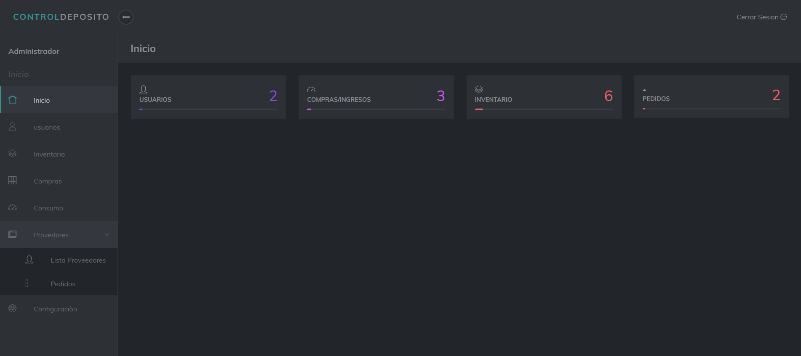

# Sistema de Gestión de Stock de equipos e insumos

_realizado con el objetivo es abordar los problemas de información en el sector Depósito de una empresa, Logrando la implementación de un sistema informático automatizado para el control de los datos de stock, que permitiría a las distintas áreas un acceso más rápido y un manejo más eficiente de los mismos._


### Instalación 🔧

_Descargar e Instalar XAMPP_

_Iniciar Servidor MySQL_

_Instalación base de datos:_

```
En el proyecto se incluye el archivo base_datos.sql el cual es la
base de datos exportada con todos sus datos y tablas.
```

_Finaliza con un ejemplo de cómo obtener datos del sistema o como usarlos para una pequeña demo_

## Modulos ⚙️

_Usuarios > Control sobre usuarios del sistema
_Inventario > Control sobre registro de productos.
_Consumo > Registros de consumos diarios.
_Compras > Fecha ingreso de empleado.
_Proveedores > Contiene lista proveedores y pedidos
_Lista proveedores > Lista y control sobre proveedores.
_Pedidos > Registro y control de pedidos a proveedores.
_Configuración > Control sobre datos de la empresa.


## Construido con 🛠️

_Menciona las herramientas que utilizaste para crear tu proyecto_

* [Html] 
* [Css] 
* [Php]
* [MySql] 

## Contribuyendo 🖇️

Por favor lee el [CONTRIBUTING.md](https://gist.github.com/villanuevand/xxxxxx) para detalles de nuestro código de conducta, y el proceso para enviarnos pull requests.

## Ingreso Sistema Web 📖

* Para poder ingresar al sistema web (nombrePrograma), guardar la carpeta “nombreCarpeta” en
c:\xampp\htdocs\ (o en cualquier otro directorio en el que haya instalado XAMPP).

* Para el ingreso al sistema las cuentas predeterminadas para esta ocasión son:
_Usuario Administrador:_
o Usuario = admin
o Clave = 20207

## Sobre Proyecto ✒️

_Este proyecto fue realizado como TESIS para recibirme en la carrera de Tecnico en Tecnologias de la Informacion en UTN Santa FE._


---
⌨️ Creado por [Jose Ignacio Martinez](https://github.com/josem207) 😊 

